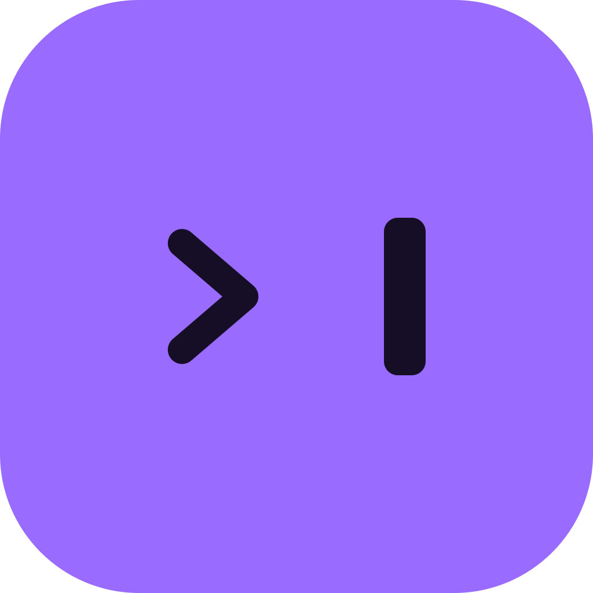

<p align="center">
  
</p>

<h1 align="center">SSH Manager</h1>

<p align="center">
  Gestionnaire de connexions <strong>SSH / SFTP / FTP</strong> pour Windows 11,<br/>
  avec terminal intégré, stockage chiffré des identifiants et mots de passes.
</p>

---

## ✨ Fonctionnalités

### Terminal & connexions
- **Terminal SSH intégré** (xterm.js) — thèmes personnalisables : 7 presets (GitHub Dark, Dracula, Monokai, Solarized, Nord, One Dark, Clair) + couleurs custom (fond, texte, curseur)
- Authentification par **mot de passe** ou **clé privée** (PEM, KEY, PPK)
- **Connexion rapide** : tapez `user@host:port` dans la barre unifiée et connectez-vous directement
- Ouverture alternative dans **PowerShell** ou **CMD**
- **Mode tuilé** : jusqu'à 4 sessions SSH côte à côte (glisser-déposer des onglets)
- **Saisie synchronisée** : exécutez la même commande dans plusieurs sessions simultanément
- **Navigateur de fichiers SFTP/FTP** : upload, download, création et suppression de dossiers

### Organisation
- Connexions présentées en **tuiles groupées**, avec **couleur par groupe** (12 couleurs)
- 4 tailles de tuiles au choix (XL / M / S / XS)
- État ouvert/fermé des groupes mémorisé entre les sessions
- Barre latérale avec **connexions récentes**, favoris ⭐, recherche et filtres par type

### Sécurité
- **Phrase de récupération de 12 mots** (BIP39) générée au premier lancement
- Identifiants chiffrés en **AES-256** — clé dérivée par PBKDF2 (210 000 itérations, SHA-512)
- Clé de chiffrement protégée par le trousseau Windows (**DPAPI** via `safeStorage`)
- **Vérification de la clé d'hôte SSH (TOFU)** — protection contre les attaques man-in-the-middle
- **Export / import chiffré** (`.enc`) : sauvegardes restaurables avec les 12 mots sur n'importe quelle machine
- Avertissements explicites pour les exports en clair et le FTP non sécurisé
- Durcissement Electron : CSP, isolation de contexte, blocage navigation/popups

### Installation & désinstallation
- Installeur **NSIS** (assistant classique) + version **portable**
- **Version portable** : choix au premier lancement entre chiffrement et stockage en clair (pour un usage nomade sur plusieurs machines)
- Proposition d'**export des données avant désinstallation**

---

## 📥 Installation (utilisateur)

Aucun prérequis — l'application embarque tout ce dont elle a besoin.

1. Téléchargez le dernier installeur depuis la page [Releases](../../releases)
2. Lancez `SSH Manager Setup x.x.x.exe` et suivez l'assistant
   *(ou utilisez la version portable, sans installation)*
3. Au premier lancement, **notez précieusement les 12 mots** affichés : ils sont indispensables pour restaurer vos données sur une autre machine

> ⚠️ **Sans la phrase de 12 mots, vos sauvegardes chiffrées sont irrécupérables.** Notez-la sur papier, jamais dans un fichier sur la même machine.

### Version portable et chiffrement

La clé de chiffrement est protégée par le trousseau Windows (DPAPI), qui est **lié à
la session Windows de la machine**. Des données chiffrées sur un PC sont donc
illisibles sur un autre.

C'est pourquoi la **version portable** propose un choix au premier lancement :

| Mode | Avantage | Limite |
|---|---|---|
| **Avec chiffrement** (recommandé) | Identifiants protégés en AES-256 | Utilisable uniquement sur la machine de configuration |
| **Sans chiffrement** | Réellement nomade (clé USB utilisable partout) | ⚠️ Mots de passe stockés **en clair** dans le fichier de données |

La version installée (NSIS) applique toujours le chiffrement — ce choix n'existe
qu'en portable.

**Configuration requise :** Windows 10/11 — 64 bits

---

## 🛠️ Développement

### Prérequis

| Outil | Version |
|---|---|
| [Node.js](https://nodejs.org/) | ≥ 18 (LTS recommandée) |
| npm | inclus avec Node.js |

### Installation des dépendances

```bash
git clone https://github.com/<votre-compte>/ssh-manager.git
cd ssh-manager
npm install
cd renderer && npm install && cd ..
```

### Lancer en mode développement (hot-reload)

Deux terminaux :

```bash
# Terminal 1 — serveur Vite (interface React)
cd renderer
npm run dev
```

```bash
# Terminal 2 — Electron
set NODE_ENV=development
npm start
```

### Builder l'application

```bash
npm run build            # Installeur NSIS + portable → dist/
npm run build:portable   # Version portable uniquement
npm run pack             # Dossier décompressé (debug) → dist/win-unpacked/
```

Les icônes sont régénérées automatiquement à chaque build à partir des vecteurs
`assets/icon.svg` (grand format) et `assets/icon-small.svg` (variante 16 et 24 px,
au trait épaissi pour rester lisible une fois réduite). Le build en dérive
`assets/icon.png` puis `assets/icon.ico`.

---

## 🏗️ Architecture

```
ssh-manager/
├── main.js              # Processus principal Electron (SSH, SFTP, FTP, chiffrement)
├── preload.js           # Pont IPC sécurisé (contextBridge)
├── assets/              # Icônes de l'application
├── build/installer.nsh  # Script NSIS (export avant désinstallation)
├── scripts/             # Outils de build (conversion d'icône)
└── renderer/            # Interface React + TypeScript (Vite)
    └── src/
        ├── App.tsx              # Composant racine, état global
        ├── types.ts             # Types TypeScript partagés
        ├── index.css            # Styles de l'application
        ├── terminal-themes.ts   # Presets de thèmes du terminal
        └── components/          # Tuiles, terminal, sidebar, modales…
```

| Couche | Technologies |
|---|---|
| Desktop | Electron 42 |
| Interface | React 18 · TypeScript · Vite |
| Terminal | xterm.js 5 |
| Protocoles | ssh2 · ssh2-sftp-client · basic-ftp |
| Chiffrement | AES-256-GCM · PBKDF2 · BIP39 · DPAPI |
| Stockage | electron-store (chiffré) |

---

## ⌨️ Raccourcis dans le terminal

| Raccourci | Action |
|-----------|--------|
| `Ctrl+C` (avec sélection) | Copier le texte sélectionné |
| `Ctrl+C` (sans sélection) | Envoyer SIGINT au shell distant |
| Clic droit | Coller depuis le presse-papiers |

---

## 🔐 Modèle de sécurité

- Les identifiants ne sont **jamais stockés en clair** : le fichier de connexions est chiffré en AES-256 avec une clé dérivée de la phrase de 12 mots
- La clé dérivée est conservée chiffrée par le **trousseau Windows** : l'app s'ouvre sans ressaisir la phrase, mais le fichier reste illisible hors de votre session Windows
- La phrase de 12 mots n'est **jamais stockée** — seul un HMAC de vérification l'est
- À la première connexion SSH, l'**empreinte du serveur est mémorisée** ; toute modification ultérieure bloque la connexion avec une alerte (modèle TOFU, comme OpenSSH)
- **Exception** : en version portable, l'utilisateur peut explicitement désactiver le chiffrement au premier lancement (après un avertissement) — voir [Version portable et chiffrement](#version-portable-et-chiffrement)

Les données locales se trouvent dans `%APPDATA%\ssh-manager\` (chiffrées, sauf mode portable sans chiffrement).

---

## 📄 Licence

Ce projet est distribué sous licence **[GPL-3.0](LICENSE)**.

Vous êtes libre d'utiliser, modifier et redistribuer ce logiciel, à condition que
toute version dérivée reste sous la même licence open source.
